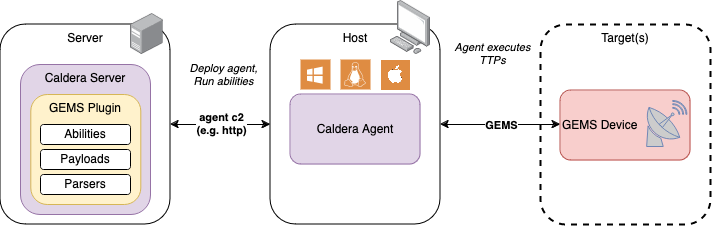

# GEMS
The Ground Equipment Monitoring Service (GEMS) plugin for Caldera provides
adversary emulation abilities specific to the OMG-GEMS communication protocol.

v1.0.0 released 6 Aug 2025

## Overview
The GEMS plugin provides __9__ abilities specific to the GEMS protocol.
Variants of each ability are provided for both the XML and ASCII message
formats defined by the GEMS specification. Adversary emulation is accomplished
not through exploitation, but rather by leveraging native functionality within
the protocol. The specification for the GEMS protocol is available free of
charge from [OMG-GEMS](https://www.omgwiki.org/space/doku.php?id=gems).

The following table outlines MITRE ATT&CK for ICS coverage provided by the GEMS
plugin.

|[Discovery](#ability-overview-table)|[Collection](#ability-overview-table)|[Impair-Process-Control](#ability-overview-table)|
|:--|:--|:--|
|Remote System Discovery|Point & Tag Identification|Modify Parameter|
| | |Brute Force I/O|
| | |Unauthorized Command Message|

### Ability Overview Table
The following table lists each plugin ability by their corresponding tactic.

|Name|Tactic|Technique|Technique Id|
|:--|:--|:--|:--|
|[GEMS - Ping](#gems---ping)|discovery|Remote System Discovery|T0846|
|[GEMS - Get Parameter](#gems---get-parameter)|collection|Point & Tag Identification|T0861|
|[GEMS - Get All Parameters](#gems---get-all-parameters)|collection|Point & Tag Identification|T0861|
|[GEMS - Get Configuration List](#gems---get-configuration-list)|collection|Point & Tag Identification|T0861|
|[GEMS - Set Parameter](#gems---set-parameter)|impair-process-control|Modify Parameter|T0836|
|[GEMS - Save Configuration](#gems---save-configuration)|impair-process-control|Unauthorized Command Message|T0855|
|[GEMS - Load Configuration](#gems---load-configuration)|impair-process-control|Modify Parameter|T0836|
|[GEMS - Send Directive](#gems---send-directive)|impair-process-control|Unauthorized Command Message|T0855|
|[GEMS - Send Directive with Arguments](#gems---send-directive-with-arguments)|impair-process-control|Unauthorized Command Message|T0855|


## Architecture
This section describes the main components of the plugin and how they interface.

### Block Diagram


The GEMS plugin exposes several new protocol specific abilities to your Caldera
instance. The abilities are executed from a host running a Caldera agent via
the corresponding payload. Abilities must target devices that support the GEMS
protocol to achieve described effects.

### Payloads
The GEMS plugin includes one payload, compiled for 3 different architectures,
to implement the abilities in the plugin.

- `gems-client.exe`: Windows executable
- `gems-client`: Linux executable
- `gems-client_darwin`: macOS (ARM) executable

### Libraries
The following libraries were used to build the GEMS payloads:  

|Library|Version|License|
|:--|:--|:--|
|cobra|[v1.8.0](https://github.com/spf13/cobra/tree/v1.8.0)|[Apache 2.0](https://github.com/spf13/cobra/blob/v1.8.0/LICENSE.txt)|

## Usage
This section describes how to initially deploy and execute the abilities
present within the GEMS Plugin.

### Deployment
1. Identify the target system you would like to communicate with via the GEMS
   protocol.
2. Identify a viable host for the Caldera agent that will be sending GEMS
   messages to the target system.
3. Deploy the Caldera agent to the identified host.
4. Use the Caldera server to execute GEMS plugin abilities to achieve the
   desired effect.  

```{tip}
Each ability contains optional parameters if needed to customize the connection
to the GEMS device. These allow you to set the GEMS version, connection token,
target device, and choose to connect using TLS.
```

```{seealso}
Reference the Caldera training plugin for a step-by-step tutorial on how to
deploy an agent and run abilities via an operation.
```

### Sample Fact Source YAML File
The plugin includes a sample fact source (also copied below) to demonstrate how to save information about your environment to use as arguments to abilities.

```yaml
id: eb1ba869-176a-46cb-a2f1-f47cc735ed68
name: GEMS Sample Facts
facts:
- trait: gems.device.addr
  value: localhost:12345
- trait: gems.device.psm
  value: ascii
- trait: gems.device.psm
  value: xml 
- trait: gems.device.user
  value: none
- trait: gems.device.password
  value: none
- trait: gems.config.name
  value: ExampleConfig 
- trait: gems.parameter.names
  value: Example,Parameter,Names
- trait: gems.parameter.value
  value: ExampleIntValue:int=1024
- trait: gems.parameter.value
  value: ExampleStringValue:string=HelloWorld
- trait: gems.directive.name
  value: ExampleDirectiveName 
```

### GEMS Authentication

The GEMS specification defines a very basic, optional authentication scheme. If
configured by the GEMS device (server), the user must identify themselves with
a username and password in the initial ConnectMessage. This information is
passed to the device in the token field of the GEMS message header. In this
plugin, the abilities are designed to allow the input of a username and
password by default. **If your device does not require authentication, set
"none" as the value for the `#{gems.device.user}` and `#{gems.device.password}`
facts**. Alternatively, arbitrary token values can be sent in the
ConnectMessage header by setting the value of the `--token` flag.

### Abilities
#### GEMS - Ping
Connect to a GEMS server and send a PingMessage.  
The PingMessage provides a method for determining if a GEMS device
is responding to messages.

__Ability Command:__
<details open>
<summary>Windows (cmd/psh)</summary>
<br>

```caldera
.\gems-client.exe ping #{gems.device.psm} #{gems.device.addr} --user #{gems.device.user} --pass #{gems.device.password}
```  

</details>
<details>
<summary>Linux (sh)</summary>
<br>

```caldera
./gems-client ping #{gems.device.psm} #{gems.device.addr} --user #{gems.device.user} --pass #{gems.device.password}
```  

</details>
<details>
<summary>Darwin (sh)</summary>
<br>

```caldera
./gems-client_darwin ping #{gems.device.psm} #{gems.device.addr} --user #{gems.device.user} --pass #{gems.device.password}
```  

</details>
<br>

__Facts:__  
| Name | Description | Type |
|:-----|:------------|:----:|
| `gems.device.psm` | message format used by the device ('ascii' or 'xml') | string |
| `gems.device.addr`| address of the device in "host:port" format | string |
| `gems.device.user`| username for authentication (send 'none' for no authentication) | string |
| `gems.device.password`| password for authentication (send 'none' for no authentication) | string |

__Optional Flags:__
| Flag | Description | Type | Default |
|:-----|:------------|:----:|:-------:|
| `--version`| set the GEMS version | string | 1.4 |
| `--target`| name of the target device | string | - |
| `--token`| GEMS connection token | string | - |
| `--tls`| connect using TLS | none | false |
| `--insecure`| allow self-signed certificates when connecting using TLS | none | false |


#### GEMS - Get Parameter 
Connect to a GEMS server and send a GetConfigMessage.  
The GetConfigMessage requests the value of a parameter in the current
configuration from the GEMS device. 

__Ability Command:__
<details open>
<summary>Windows (cmd/psh)</summary>
<br>

```caldera
.\gems-client.exe get #{gems.device.psm} #{gems.device.addr} --names #{gems.parameter.names} --user #{gems.device.user} --pass #{gems.device.password}
```  

</details>
<details>
<summary>Linux (sh)</summary>
<br>

```caldera
./gems-client get #{gems.device.psm} #{gems.device.addr} --names #{gems.parameter.names} --user #{gems.device.user} --pass #{gems.device.password}
```  

</details>
<details>
<summary>Darwin (sh)</summary>
<br>

```caldera
./gems-client_darwin get #{gems.device.psm} #{gems.device.addr} --names #{gems.parameter.names} --user #{gems.device.user} --pass #{gems.device.password}
```  

</details>
<br>

__Facts:__  
| Name | Description | Type |
|:-----|:------------|:----:|
| `gems.device.psm` | message format used by the device ('ascii' or 'xml') | string |
| `gems.device.addr`| address of the device in "host:port" format | string |
| `gems.device.user`| username for authentication (send 'none' for no authentication) | string |
| `gems.device.password`| password for authentication (send 'none' for no authentication) | string |
| `gems.parameter.names` | desired parameter names | comma separated list of strings |

__Optional Flags:__
| Flag | Description | Type | Default |
|:-----|:------------|:----:|:-------:|
| `--version`| set the GEMS version | string | 1.4 |
| `--target`| name of the target device | string | - |
| `--token`| GEMS connection token | string | - |
| `--tls`| connect using TLS | none | false |
| `--insecure`| allow self-signed certificates when connecting using TLS | none | false |

#### GEMS - Get All Parameters
Connect to a GEMS server and send a GetConfigMessage.  
The GetConfigMessage with no parameters specified requests the values
of all parameters in the current configuration from the GEMS device. 

__Ability Command:__
<details open>
<summary>Windows (cmd/psh)</summary>
<br>

```caldera
.\gems-client.exe get #{gems.device.psm} #{gems.device.addr} --user #{gems.device.user} --pass #{gems.device.password}
```  

</details>
<details>
<summary>Linux (sh)</summary>
<br>

```caldera
./gems-client get #{gems.device.psm} #{gems.device.addr} --user #{gems.device.user} --pass #{gems.device.password}
```  

</details>
<details>
<summary>Darwin (sh)</summary>
<br>

```caldera
./gems-client_darwin get #{gems.device.psm} #{gems.device.addr} --user #{gems.device.user} --pass #{gems.device.password}
```  

</details>
<br>

__Facts:__  
| Name | Description | Type |
|:-----|:------------|:----:|
| `gems.device.psm` | message format used by the device ('ascii' or 'xml') | string |
| `gems.device.addr`| address of the device in "host:port" format | string |
| `gems.device.user`| username for authentication (send 'none' for no authentication) | string |
| `gems.device.password`| password for authentication (send 'none' for no authentication) | string |

__Optional Flags:__
| Flag | Description | Type | Default |
|:-----|:------------|:----:|:-------:|
| `--version`| set the GEMS version | string | 1.4 |
| `--target`| name of the target device | string | - |
| `--token`| GEMS connection token | string | - |
| `--tls`| connect using TLS | none | false |
| `--insecure`| allow self-signed certificates when connecting using TLS | none | false |


#### GEMS - Set Parameter 
Connects to a GEMS server and sends a SetConfigMessage.  
The SetConfigMessage contains a list of parameters to set and their new values.
Parameters are passed using the `-p` or `--param` flag and must be formatted as defined
by GEMS ASCII. 

```{tip}
The ability is configured to set one parameter at a time, but the `--param` flag
can be repeated to set more than one parameter in a single message.
```

__Ability Command:__
<details open>
<summary>Windows (cmd/psh)</summary>
<br>

```caldera
.\gems-client.exe set #{gems.device.psm} #{gems.device.addr} --param #{gems.parameter.value} --user #{gems.device.user} --pass #{gems.device.password}
```  

</details>
<details>
<summary>Linux (sh)</summary>
<br>

```caldera
./gems-client set #{gems.device.psm} #{gems.device.addr} --param #{gems.parameter.value} --user #{gems.device.user} --pass #{gems.device.password}
```  

</details>
<details>
<summary>Darwin (sh)</summary>
<br>

```caldera
./gems-client_darwin set #{gems.device.psm} #{gems.device.addr} --param #{gems.parameter.value} --user #{gems.device.user} --pass #{gems.device.password}
```  

</details>
<br>

__Facts:__  
| Name | Description | Type |
|:-----|:------------|:----:|
| `gems.device.psm` | message format used by the device ('ascii' or 'xml') | string |
| `gems.device.addr`| address of the device in "host:port" format | string |
| `gems.device.user`| username for authentication (send 'none' for no authentication) | string |
| `gems.device.password`| password for authentication (send 'none' for no authentication) | string |
| `gems.parameter.value` | a GEMS parameter formatted as defined by GEMS ASCII | string |

__Optional Flags:__
| Flag | Description | Type | Default |
|:-----|:------------|:----:|:-------:|
| `--version`| set the GEMS version | string | 1.4 |
| `--target`| name of the target device | string | - |
| `--token`| GEMS connection token | string | - |
| `--tls`| connect using TLS | none | false |
| `--insecure`| allow self-signed certificates when connecting using TLS | none | false |

#### GEMS - Save Configuration
Connects to a GEMS server and sends a SaveConfigMessage.  
The SaveConfigMessage saves the configuration as the provided name.
The configuration name is an alphanumeric string with no spaces.

__Ability Command:__
<details open>
<summary>Windows (cmd/psh)</summary>
<br>

```caldera
.\gems-client.exe save #{gems.device.psm} #{gems.device.addr} #{gems.config.name} --user #{gems.device.user} --pass #{gems.device.password}
```  

</details>
<details>
<summary>Linux (sh)</summary>
<br>

```caldera
./gems-client save #{gems.device.psm} #{gems.device.addr} #{gems.config.name} --user #{gems.device.user} --pass #{gems.device.password}
```  

</details>
<details>
<summary>Darwin (sh)</summary>
<br>

```caldera
./gems-client_darwin save #{gems.device.psm} #{gems.device.addr} #{gems.config.name} --user #{gems.device.user} --pass #{gems.device.password}
```  

</details>
<br>

__Facts:__  
| Name | Description | Type |
|:-----|:------------|:----:|
| `gems.device.psm` | message format used by the device ('ascii' or 'xml') | string |
| `gems.device.addr`| address of the device in "host:port" format | string |
| `gems.device.user`| username for authentication (send 'none' for no authentication) | string |
| `gems.device.password`| password for authentication (send 'none' for no authentication) | string |
| `gems.config.name`| name to assign to the configuration | string |

__Optional Flags:__
| Flag | Description | Type | Default |
|:-----|:------------|:----:|:-------:|
| `--version`| set the GEMS version | string | 1.4 |
| `--target`| name of the target device | string | - |
| `--token`| GEMS connection token | string | - |
| `--tls`| connect using TLS | none | false |
| `--insecure`| allow self-signed certificates when connecting using TLS | none | false |

#### GEMS - Load Configuration
Connects to a GEMS server and sends a LoadConfigMessage.  
The LoadConfigMessage loads the configuration with the provided name.
The configuration name is an alphanumeric string with no spaces.

__Ability Command:__
<details open>
<summary>Windows (cmd/psh)</summary>
<br>

```caldera
.\gems-client.exe load #{gems.device.psm} #{gems.device.addr} #{gems.config.name} --user #{gems.device.user} --pass #{gems.device.password}
```  

</details>
<details>
<summary>Linux (sh)</summary>
<br>

```caldera
./gems-client load #{gems.device.psm} #{gems.device.addr} #{gems.config.name} --user #{gems.device.user} --pass #{gems.device.password}
```  

</details>
<details>
<summary>Darwin (sh)</summary>
<br>

```caldera
./gems-client_darwin load #{gems.device.psm} #{gems.device.addr} #{gems.config.name} --user #{gems.device.user} --pass #{gems.device.password}
```  

</details>
<br>

__Facts:__  
| Name | Description | Type |
|:-----|:------------|:----:|
| `gems.device.psm` | message format used by the device ('ascii' or 'xml') | string |
| `gems.device.addr`| address of the device in "host:port" format | string |
| `gems.device.user`| username for authentication (send 'none' for no authentication) | string |
| `gems.device.password`| password for authentication (send 'none' for no authentication) | string |
| `gems.config.name`| name of the configuration to load | string |

__Optional Flags:__
| Flag | Description | Type | Default |
|:-----|:------------|:----:|:-------:|
| `--version`| set the GEMS version | string | 1.4 |
| `--target`| name of the target device | string | - |
| `--token`| GEMS connection token | string | - |
| `--tls`| connect using TLS | none | false |
| `--insecure`| allow self-signed certificates when connecting using TLS | none | false |

#### GEMS - Get Configuration List
Connects to a GEMS server and sends a GetConfigListMessage.  
The GetConfigListMessage retrieves all configurations available on
the GEMS device.

__Ability Command:__
<details open>
<summary>Windows (cmd/psh)</summary>
<br>

```caldera
.\gems-client.exe get-config-list #{gems.device.psm} #{gems.device.addr} --user #{gems.device.user} --pass #{gems.device.password}
```  

</details>
<details>
<summary>Linux (sh)</summary>
<br>

```caldera
./gems-client get-config-list #{gems.device.psm} #{gems.device.addr} --user #{gems.device.user} --pass #{gems.device.password}
```  

</details>
<details>
<summary>Darwin (sh)</summary>
<br>

```caldera
./gems-client_darwin get-config-list #{gems.device.psm} #{gems.device.addr} --user #{gems.device.user} --pass #{gems.device.password}
```  

</details>
<br>

__Facts:__  
| Name | Description | Type |
|:-----|:------------|:----:|
| `gems.device.psm` | message format used by the device ('ascii' or 'xml') | string |
| `gems.device.addr`| address of the device in "host:port" format | string |
| `gems.device.user`| username for authentication (send 'none' for no authentication) | string |
| `gems.device.password`| password for authentication (send 'none' for no authentication) | string |

__Optional Flags:__
| Flag | Description | Type | Default |
|:-----|:------------|:----:|:-------:|
| `--version`| set the GEMS version | string | 1.4 |
| `--target`| name of the target device | string | - |
| `--token`| GEMS connection token | string | - |
| `--tls`| connect using TLS | none | false |
| `--insecure`| allow self-signed certificates when connecting using TLS | none | false |


#### GEMS - Send Directive
Connects to a GEMS server and sends a DirectiveMessage.  
The DirectiveMessage invokes an action on the GEMS device.

```{seealso}
To send arguments along with a directive, use the [GEMS - Send Directive with Arguments](#gems---send-directive-with-arguments) ability.
```

__Ability Command:__
<details open>
<summary>Windows (cmd/psh)</summary>
<br>

```caldera
.\gems-client.exe directive #{gems.device.psm} #{gems.device.addr} #{gems.directive.name} --user #{gems.device.user} --pass #{gems.device.password}
```  

</details>
<details>
<summary>Linux (sh)</summary>
<br>

```caldera
./gems-client directive #{gems.device.psm} #{gems.device.addr} #{gems.directive.name} --user #{gems.device.user} --pass #{gems.device.password}
```  

</details>
<details>
<summary>Darwin (sh)</summary>
<br>

```caldera
./gems-client_darwin directive #{gems.device.psm} #{gems.device.addr} #{gems.directive.name} --user #{gems.device.user} --pass #{gems.device.password}
```  

</details>
<br>

__Facts:__  
| Name | Description | Type |
|:-----|:------------|:----:|
| `gems.device.psm` | message format used by the device ('ascii' or 'xml') | string |
| `gems.device.addr`| address of the device in "host:port" format | string |
| `gems.device.user`| username for authentication (send 'none' for no authentication) | string |
| `gems.device.password`| password for authentication (send 'none' for no authentication) | string |
| `gems.directive.name`| name of the directive to call | string |

__Optional Flags:__
| Flag | Description | Type | Default |
|:-----|:------------|:----:|:-------:|
| `--version`| set the GEMS version | string | 1.4 |
| `--target`| name of the target device | string | - |
| `--token`| GEMS connection token | string | - |
| `--tls`| connect using TLS | none | false |
| `--insecure`| allow self-signed certificates when connecting using TLS | none | false |

#### GEMS - Send Directive with Arguments
Connects to a GEMS server and sends a DirectiveMessage.  
The DirectiveMessage invokes an action on the GEMS device. The message may contain
contain a list of parameter arguments. Parameters are passed using the `--params`
flag and must be formatted as defined by GEMS ASCII. Multiple parameters must be 
separated by the pipe character (`|`).

```{warning}
The pipe character (`|`) may need to be escaped with a backslash (`\|`) depending on the shell in use by the agent.
```

__Ability Command:__
<details open>
<summary>Windows (cmd/psh)</summary>
<br>

```caldera
.\gems-client.exe directive #{gems.device.psm} #{gems.device.addr} #{gems.directive.name} --params #{gems.parameter.value} --user #{gems.device.user} --pass #{gems.device.password}
```  

</details>
<details>
<summary>Linux (sh)</summary>
<br>

```caldera
./gems-client directive #{gems.device.psm} #{gems.device.addr} #{gems.directive.name} --params #{gems.parameter.value} --user #{gems.device.user} --pass #{gems.device.password}
```  

</details>
<details>
<summary>Darwin (sh)</summary>
<br>

```caldera
./gems-client_darwin directive #{gems.device.psm} #{gems.device.addr} #{gems.directive.name} --params #{gems.parameter.value} --user #{gems.device.user} --pass #{gems.device.password}
```  

</details>
<br>

__Facts:__  
| Name | Description | Type |
|:-----|:------------|:----:|
| `gems.device.psm` | message format used by the device ('ascii' or 'xml') | string |
| `gems.device.addr`| address of the device in "host:port" format | string |
| `gems.device.user`| username for authentication (send 'none' for no authentication) | string |
| `gems.device.password`| password for authentication (send 'none' for no authentication) | string |
| `gems.directive.name`| name of the directive to call | string |
| `gems.parameter.value`| GEMS parameter(s) formatted as defined by GEMS ASCII | string |

__Optional Flags:__
| Flag | Description | Type | Default |
|:-----|:------------|:----:|:-------:|
| `--version`| set the GEMS version | string | 1.4 |
| `--target`| name of the target device | string | - |
| `--token`| GEMS connection token | string | - |
| `--tls`| connect using TLS | none | false |
| `--insecure`| allow self-signed certificates when connecting using TLS | none | false |

### Source Code
The source code for the plugin payloads can be found inside this plugin's `src`
directory.

### Copyright Notice
GEMS® is a registered trademark of Object Management Group, 9C Medway Road, PMB
274, Milford, MA 01757, USA.

This Caldera plugin is named GEMS in order to describe its scope and purpose.
This plugin is not produced by or affiliated with Object Management Group.
